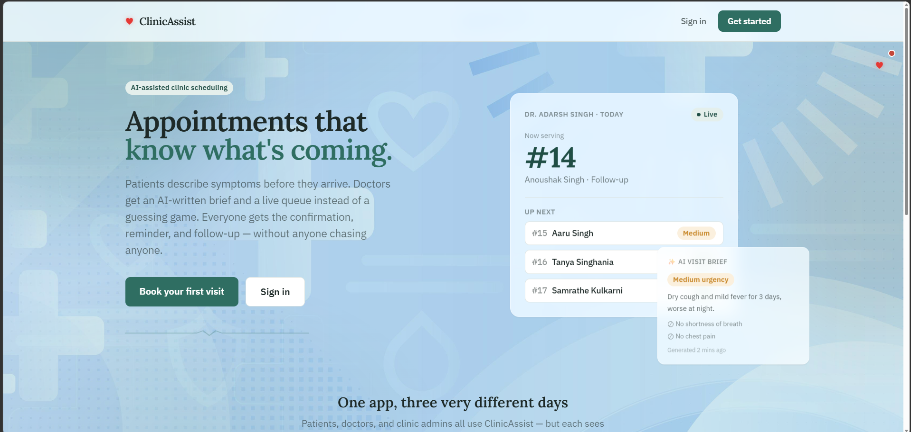
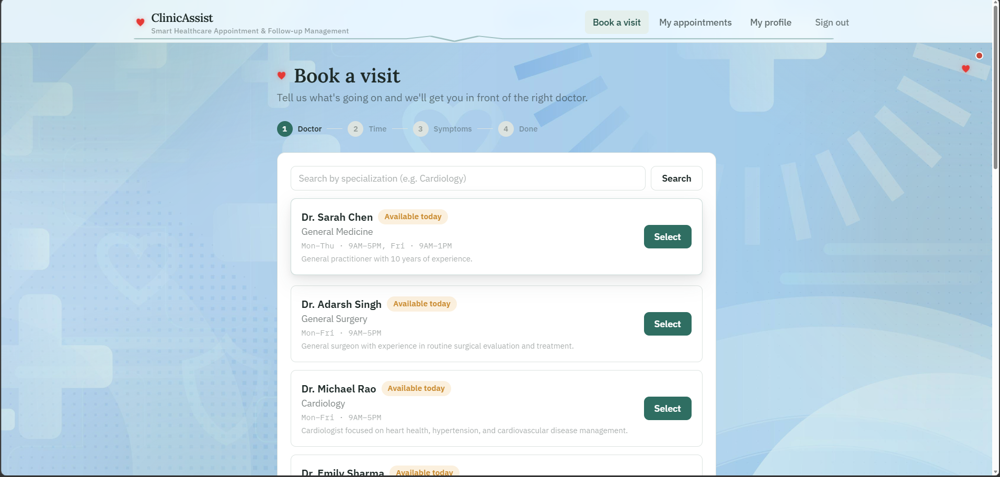
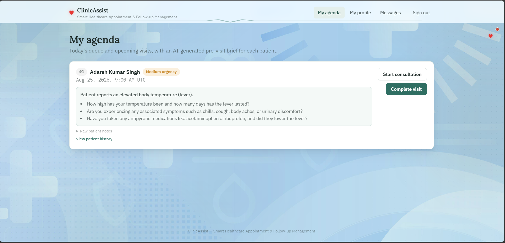
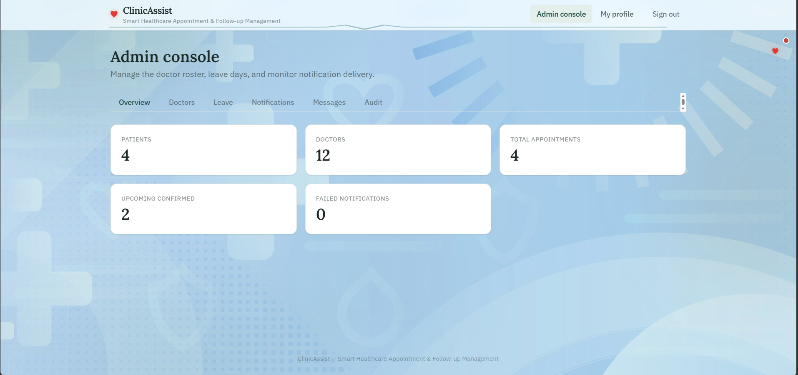
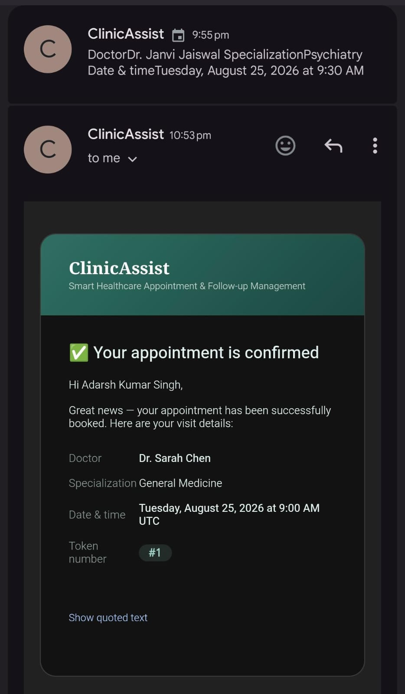
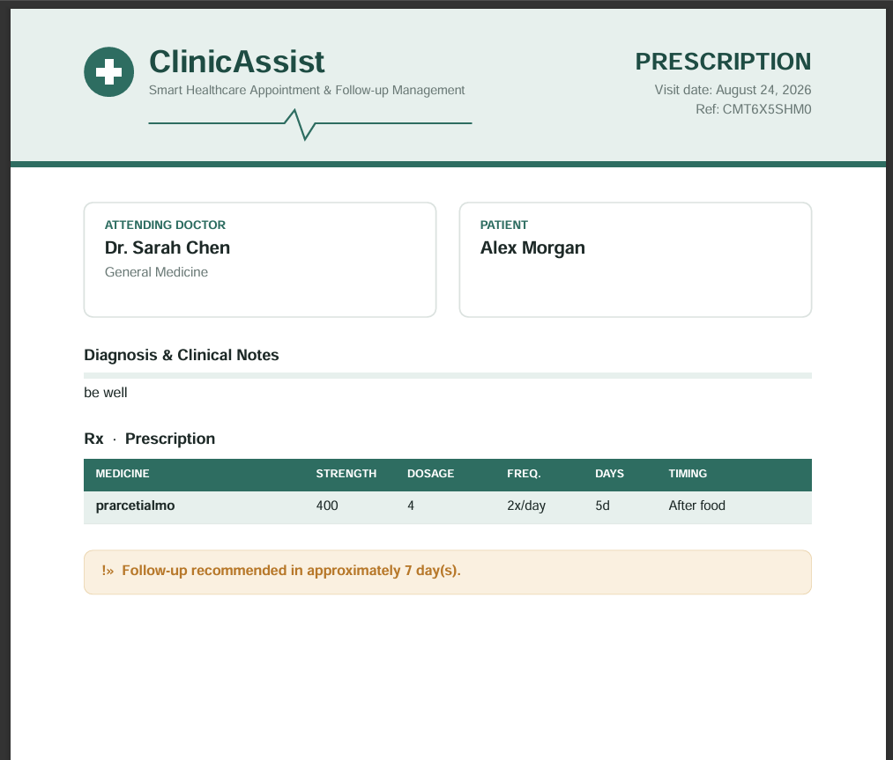

# 🏥 ClinicAssist

> **Smart Healthcare Appointment & Follow-up Management**

ClinicAssist is a full-stack healthcare appointment platform connecting **patients, doctors, and clinic administrators** through one workflow.

Patients can find doctors by specialization, describe symptoms before a visit, book available slots, receive appointment notifications, track token numbers, download prescriptions, and add appointments directly to their calendar.

Doctors get a live appointment queue, AI-assisted pre-visit summaries, urgency indicators, patient information, and post-visit documentation tools.

Administrators can manage doctors, working hours, leave requests, and clinic operations.

---

## ✨ Key Features

### 👤 Patient Portal

- Secure registration and login
- Search doctors by **specialization**
- View doctor information, qualifications, bio, and availability
- See whether a doctor is:
  - 🟢 Available now
  - 🟡 Available today
  - ⚪ Not available today
- Select appointment date and available time slot
- Describe symptoms before confirming an appointment
- Optionally provide a mobile number
- Receive **appointment confirmation emails**
- Receive cancellation and schedule-update notifications
- View upcoming and past appointments
- Track appointment **token number / queue position**
- View AI-generated post-visit summaries
- **Download prescriptions**
- **Add appointments directly to Google Calendar / supported calendar applications**
- Receive follow-up information

### 👨‍⚕️ Doctor Portal

- Dedicated doctor dashboard
- View today's appointment queue
- See patient token numbers and appointment status
- Review patient-submitted symptoms
- View an **AI-generated pre-visit summary**
- See an AI-assisted urgency indicator
- Manage appointment status
- Record doctor notes
- Create structured prescriptions
- Generate patient-friendly post-visit summaries
- Manage working availability
- Receive **new appointment notification emails**
- Receive cancellation and schedule-update notifications

### 🛠️ Admin Portal

- Dedicated administrator dashboard
- Create and manage doctor accounts
- Configure specialization, qualifications, bio, working hours, slot duration, and leave days
- Manage doctor availability
- Manage doctor leave
- Monitor appointment operations

### 🤖 AI-Assisted Healthcare Workflow

ClinicAssist uses AI to help doctors prepare for appointments.

**Pre-visit summary**

- Chief complaint
- Urgency level
- Key symptoms
- Suggested questions for the doctor

**Post-visit summary**

- Visit summary
- Medication information
- Follow-up instructions
- Next steps

> AI-generated information is assistive and does not replace professional medical judgment or emergency medical services.

---

## 📧 Email Notifications

ClinicAssist keeps **both sides of the appointment informed**.

### Patient receives

- Appointment confirmation
- Appointment cancellation or schedule updates
- Follow-up information
- Other appointment-related notifications

### Doctor receives

- New appointment notification
- Appointment cancellation or schedule updates
- Relevant appointment information
- Other appointment-related notifications

```text
Appointment Created
        │
        ├──► Patient confirmation email
        │
        └──► Doctor appointment notification
```

---

## 📅 Calendar Integration

Patients can add a confirmed appointment directly to their calendar.

Calendar information can include:

- Doctor name
- Appointment date
- Start time
- End time
- Appointment description

ClinicAssist also supports Google Calendar OAuth integration.

---

## 💊 Prescription Management

Doctors can create structured prescriptions containing:

- Medicine name
- Frequency
- Duration
- Additional instructions where applicable

Patients can view the completed prescription and **download it for their records**.

---

## 🖼️ Screenshots

Add project screenshots here.

### Landing Page



### Patient Booking



### Doctor Dashboard



### Admin Dashboard



### Appointment Confirmation



### Prescription



> Store README screenshots in `docs/images/`.

---

## 🏗️ Application Workflow

```text
Patient
   │
   ├── Register / Login
   ├── Search Doctor
   ├── Select Date & Time
   ├── Describe Symptoms
   └── Confirm Appointment
              │
              ├──────────────► Patient Email
              ├──────────────► Doctor Email
              ├──────────────► Calendar
              └──────────────► Doctor Queue
                                      │
                                      ▼
                              AI Pre-Visit Summary
                                      │
                                      ▼
                                Doctor Consultation
                                      │
                         ┌────────────┴────────────┐
                         ▼                         ▼
                   Doctor Notes              Prescription
                         │                         │
                         └────────────┬────────────┘
                                      ▼
                              AI Post-Visit Summary
                                      │
                                      ▼
                                    Patient
```

---

## 🧰 Technology Stack

### Frontend

- React
- TypeScript
- Vite
- Tailwind CSS
- React Router
- Axios

### Backend

- Node.js
- Express
- TypeScript
- Prisma
- REST API
- JWT Authentication

### Database

- PostgreSQL

### AI

- Google Gemini API

Used for pre-visit summaries, urgency classification, suggested questions, and post-visit patient-friendly summaries.

### Integrations

- Google Sign-In
- Google Calendar
- Transactional email
- JWT authentication

### Tools

- Git
- GitHub
- VS Code
- Postman

---

# 🚀 Setup Guide

## Prerequisites

| Requirement | Purpose |
|---|---|
| Node.js 18+ | Frontend and backend runtime |
| PostgreSQL | Application database |
| Gemini API key | AI-assisted summaries |
| Google Cloud project | Google Sign-In / Calendar |
| OAuth 2.0 credentials | Google authentication and calendar integration |
| Email provider credentials | Appointment notifications |

## Clone Repository

```bash
git clone <YOUR_GITHUB_REPOSITORY_URL>
cd clinicassist
```

## Backend

```bash
cd backend
npm install
```

Create:

```text
backend/.env
```

Then start:

```bash
npm run dev
```

## Frontend

```bash
cd frontend
npm install
```

Create:

```text
frontend/.env
```

Example:

```env
VITE_API_URL=http://localhost:4000
```

Start:

```bash
npm run dev
```

The frontend is typically available at:

```text
http://localhost:5173
```
Open http://localhost:5173 and sign in with one of the seeded accounts (also shown on the
login screen):

| Role    | Email                        | Password         |
|---------|-------------------------------|-------------------|
| Admin   | admin@clinicassist.example    | AdminPass123!     |
| Doctor  | dr.sarah@clinicassist.example | DoctorPass123!    |
| Patient | patient@example.com           | PatientPass123!   |

Seeded demo accounts are pre-verified so they skip the OTP step. Patients can also
self-register from the login screen (this does go through OTP verification). Doctors and
admins are provisioned by an existing admin (seed script creates the first one).

---

# 🔑 Environment Variables

Backend:

```env
DATABASE_URL=
JWT_SECRET=
JWT_EXPIRES_IN=7d

GEMINI_API_KEY=

GOOGLE_CLIENT_ID=
GOOGLE_CLIENT_SECRET=
GOOGLE_REDIRECT_URI=http://localhost:4000/api/calendar/oauth/callback

EMAIL_FROM=
```

Frontend:

```env
VITE_API_URL=http://localhost:4000
VITE_GOOGLE_CLIENT_ID=
```

> Never commit `.env` files or API keys to GitHub.

---

# 🤖 Gemini API Setup

1. Open Google AI Studio.
2. Sign in.
3. Create an API key.
4. Add it to the backend:

```env
GEMINI_API_KEY=your_gemini_api_key
```

Keep the Gemini API key on the backend and never expose it in frontend code.

---

# 🔵 Google Sign-In Setup

Create an OAuth 2.0 Client ID in Google Cloud Console.

For the local frontend, add:

```text
http://localhost:5173
```

as an authorized JavaScript origin.

For Calendar, add:

```text
http://localhost:4000/api/calendar/oauth/callback
```

as an authorized redirect URI.

Use the production URLs when deploying.

---

# 📅 Google Calendar Setup

1. Create or select a Google Cloud project.
2. Enable **Google Calendar API**.
3. Configure the OAuth consent screen.
4. Create an OAuth 2.0 Client ID.
5. Select **Web application**.
6. Add the frontend origin.
7. Add the backend calendar callback.
8. Copy Client ID and Secret into `.env`.
9. Configure `VITE_GOOGLE_CLIENT_ID` on the frontend.

---

# 🗄️ Database

ClinicAssist uses PostgreSQL with Prisma.

After configuring `DATABASE_URL`:

```bash
npx prisma generate
npx prisma migrate dev
```

To inspect the database:

```bash
npx prisma studio
```

---

# 📆 Appointment Booking Flow

### 1. Choose Doctor

Patient searches by specialization and selects a doctor.

### 2. Choose Slot

Patient selects a date and available time.

### 3. Describe Symptoms

Patient submits symptoms before confirming.

### 4. Confirm Appointment

After successful booking:

- Appointment is confirmed
- Token number can be generated
- Patient receives confirmation email
- Doctor receives appointment notification
- Patient can add the appointment to their calendar

---

# 🧠 AI Visit Brief

Example:

```text
Urgency: Medium

Chief Complaint:
Dry cough and mild fever for 3 days.

Key Information:
- Symptoms worse at night
- No shortness of breath
- No chest pain

Suggested Questions:
- Has the fever increased recently?
- Is the cough producing mucus?
- Have you taken any medication?
```

The exact output depends on the configured AI model and prompts.

---

# 🩺 Post-Visit Workflow

After consultation, the doctor can enter:

- Clinical notes
- Prescription
- Medicine frequency
- Treatment duration
- Follow-up instructions

ClinicAssist can generate a patient-friendly post-visit summary.

---

# 💊 Prescription Download

After a doctor completes a prescription:

1. Patient opens the completed appointment.
2. Prescription information is displayed.
3. Patient can **download the prescription** for personal records.

---

# 🔒 Double-Booking Protection

The backend validates appointment availability before creating an appointment and uses database-level protection where configured.

This prevents relying only on frontend availability checks when multiple users attempt to book the same slot.

---

# 🗂️ Suggested Project Structure

```text
clinicassist/
│
├── backend/
│   ├── src/
│   │   ├── controllers/
│   │   ├── routes/
│   │   ├── services/
│   │   ├── middleware/
│   │   └── utils/
│   ├── prisma/
│   │   ├── schema.prisma
│   │   └── migrations/
│   ├── .env.example
│   └── package.json
│
├── frontend/
│   ├── public/
│   │   └── images/
│   ├── src/
│   │   ├── components/
│   │   ├── context/
│   │   ├── pages/
│   │   ├── utils/
│   │   └── api/
│   ├── .env.example
│   └── package.json
│
├── docs/
│   └── images/
│
└── README.md
```

---

# 🌐 Deployment

ClinicAssist can be deployed with separate frontend and backend services.

### Frontend

- Vercel
- Netlify
- Render

### Backend

- Render
- Railway
- Other Node.js-compatible hosting

### Database

- Neon
- Supabase
- Railway
- Render
- Other managed PostgreSQL providers

Before production deployment, update:

- Frontend API URL
- Google OAuth origins
- Google OAuth redirect URI
- Database URL
- JWT secret
- Gemini API key
- Email credentials

---

# 🚀 Future Improvements

- Real-time doctor queue updates
- Automatic appointment reminders
- SMS / WhatsApp notifications
- Improved prescription PDF generation
- Doctor availability calendar
- Patient medical history timeline
- Medical document uploads
- Appointment analytics
- Multi-clinic support
- Granular permissions
- Enhanced audit logging
- Additional calendar providers

---

# 📌 Important Notes

ClinicAssist is a software project for healthcare appointment and workflow management.

AI-generated summaries are **assistive outputs** and should not be treated as a diagnosis or replacement for a qualified healthcare professional.

Emergency symptoms should be handled through appropriate emergency medical services rather than relying on appointment scheduling or AI-generated summaries.

---

# 👨‍💻 Project

**ClinicAssist**

Smart Healthcare Appointment & Follow-up Management

```text
Patient ↔ Doctor ↔ Admin
        │
        ├── Appointment Scheduling
        ├── AI-Assisted Visit Summaries
        ├── Email Notifications
        ├── Calendar Integration
        ├── Prescription Management
        └── Follow-up Management
```

---
<p align="center">
  Patient ↔ doctor ↔ admin appointment workflow · AI-assisted visit summaries · email + calendar notifications
</p>
